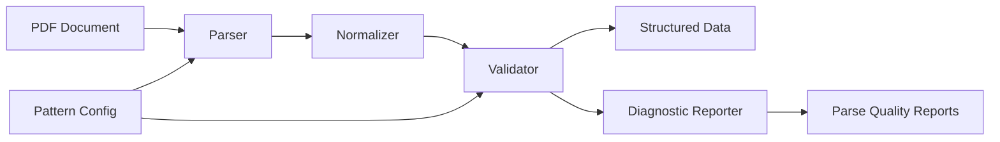
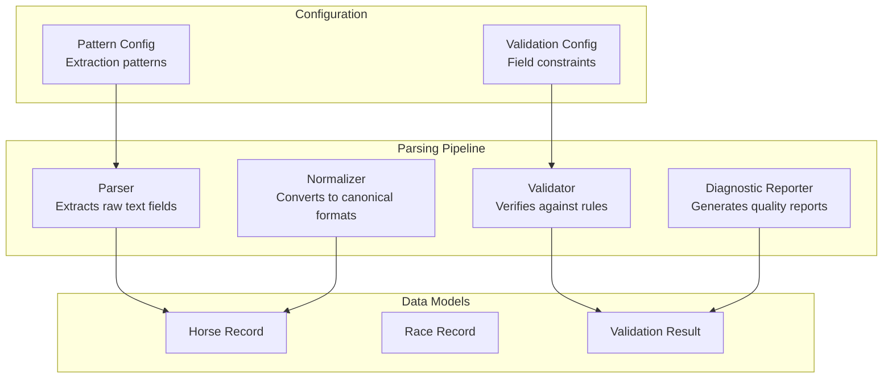

# Design Document: Robust PDF Parsing System

## Overview

The Robust PDF Parsing System is a modular, extensible architecture for extracting structured data from horse racing past performance PDFs with high accuracy (>95% for critical fields), systematic validation, and comprehensive diagnostics. The system addresses current parsing failures (jockey parsing at 43% in some races, distance format issues like 6½ → 6.0) through a pipeline architecture with clear separation of concerns.

### Design Goals

1. **High Accuracy**: Achieve >95% extraction accuracy for critical fields (jockey, trainer, odds, distance, speed figures)
2. **Maintainability**: Configuration-driven patterns separate from parsing logic
3. **Observability**: Detailed diagnostics showing per-field, per-race extraction success rates
4. **Extensibility**: Easy addition of new fields without modifying core parsing logic
5. **Reliability**: Regression testing framework prevents future breakage

### Key Design Decisions

**Pipeline Architecture**: Parser → Normalizer → Validator → Reporter provides clear separation of concerns. Each component has a single responsibility and can be tested independently.

**Configuration-Driven Patterns**: Extraction patterns defined in configuration files (JSON/YAML) rather than hardcoded in parsing logic. This enables non-developers to adjust patterns and supports A/B testing of pattern variants.

**Fail-Fast Validation**: Validation occurs immediately after normalization, before data enters the modeling pipeline. Invalid data is flagged with detailed diagnostics rather than silently defaulting to 0.0.

**Regression Testing as First-Class Concern**: Baseline extraction results stored in version control. CI pipeline fails if extraction accuracy drops below thresholds.

## Architecture

### System Context



### Component Diagram



### Data Flow

1. **Extraction Phase**: Parser reads PDF text, applies extraction patterns from configuration, produces raw field values
2. **Normalization Phase**: Normalizer converts raw values to canonical formats (e.g., "6½Furlongs" → 6.5)
3. **Validation Phase**: Validator checks normalized values against constraints, produces validation results
4. **Reporting Phase**: Reporter aggregates validation results, generates per-field and per-race quality metrics

## Components and Interfaces

### Parser Component

**Responsibility**: Extract raw text fields from PDF using configurable patterns.

**Interface**:
```python
class Parser:
    def __init__(self, config: PatternConfig):
        """Initialize parser with extraction pattern configuration."""
        
    def extract_text(self, pdf_path: str) -> str:
        """Extract raw text from PDF. Returns full text or None on error."""
        
    def parse_races(self, text: str) -> List[RaceRecord]:
        """Parse all races from extracted text. Returns list of RaceRecord objects."""
        
    def parse_horse_block(self, block: str, config: FieldPatternSet) -> HorseRecord:
        """Parse a single horse's data block using configured patterns.
        
        Returns HorseRecord with:
        - Raw extracted values
        - Parsed flags indicating which fields were successfully extracted
        - Raw text snippets for failed extractions (for diagnostics)
        """
```

**Key Design Elements**:

- **Pattern Priority**: Each field can have multiple extraction patterns with priority order. Parser attempts patterns sequentially until one succeeds.
- **Parsed Flags**: Each field has a corresponding `{field}_parsed` boolean flag (e.g., `odds_parsed`, `jockey_parsed`) to distinguish successful extraction from default fallback values.
- **Raw Text Capture**: When extraction fails, parser stores the raw text block where extraction was attempted. This enables diagnostic reporting without re-parsing.
- **Line-by-Line Matching**: For complex patterns prone to catastrophic backtracking (e.g., jockey names), parser processes text line-by-line with pre-filtering before applying regex.

**Pattern Configuration Structure**:
```python
@dataclass
class FieldPattern:
    name: str                    # Field identifier (e.g., "jockey_name")
    patterns: List[str]          # Regex patterns in priority order
    default_value: Any           # Fallback value if all patterns fail
    pre_filter: Optional[str]    # Quick string check before regex (performance)
    exclude_keywords: List[str]  # Skip lines containing these keywords
    
@dataclass
class PatternConfig:
    fields: Dict[str, FieldPattern]  # Field name -> pattern configuration
    version: str                      # Config version for tracking
```

### Normalizer Component

**Responsibility**: Convert raw extracted values to canonical formats.

**Interface**:
```python
class Normalizer:
    def normalize_distance(self, raw: str) -> float:
        """Convert distance string to furlongs (float, 2 decimal places).
        
        Handles:
        - "6½Furlongs" → 6.5
        - "1m70yds" → 8.318
        - "6┬╜ft" (mojibake) → 6.5
        
        Returns 0.0 if unparseable, logs raw text for diagnostics.
        """
        
    def normalize_name(self, raw: str, name_type: str) -> str:
        """Convert name to title case, handle suffixes.
        
        name_type: "jockey" or "trainer"
        
        Jockey: "LASTNAME FIRSTNAME" → "Firstname Lastname"
                "LASTNAME, JR. FIRSTNAME" → "Firstname Lastname" (suffix removed)
        Trainer: "LASTNAME FIRSTNAME" → "Lastname Firstname"
                 "LASTNAME, JR. FIRSTNAME" → "Lastname, Jr. Firstname" (suffix preserved)
        """
        
    def normalize_percentage(self, raw: str) -> float:
        """Convert percentage string to decimal (0.0-1.0).
        
        "25%" → 0.25
        "0%" → 0.0
        """
        
    def normalize_odds(self, raw: str) -> float:
        """Convert odds string to decimal.
        
        "5/2" → 2.5
        "3/1" → 3.0
        
        Returns 10.0 (default) if unparseable.
        """
        
    def normalize_horse_record(self, record: HorseRecord) -> HorseRecord:
        """Apply all normalization rules to a horse record in-place."""
```

**Key Design Elements**:

- **Mojibake Handling**: Distance normalizer uses leading-digit extraction patterns to handle character encoding corruption (e.g., "6┬╜" → extract "6", infer fraction from context).
- **Fractional Distance Inference**: When fraction characters are corrupted, normalizer checks for common patterns:
  - Token ends with "f" or "Furlongs" → likely fractional furlong
  - Token contains "m" → mile conversion (1m = 8f)
  - Yards present → convert to furlongs (220 yards = 1 furlong)
- **Logging**: All normalization failures logged with raw input for diagnostic analysis.

### Validator Component

**Responsibility**: Verify normalized values against expected constraints.

**Interface**:
```python
@dataclass
class ValidationRule:
    field: str
    rule_type: str  # "range", "enum", "pattern", "custom"
    constraint: Any  # Range tuple, enum set, regex pattern, or callable
    severity: str   # "error", "warning"
    message: str    # Human-readable description
    
@dataclass
class ValidationResult:
    field: str
    value: Any
    is_valid: bool
    rule: ValidationRule
    message: str
    
class Validator:
    def __init__(self, config: ValidationConfig):
        """Initialize validator with validation rule configuration."""
        
    def validate_field(self, field: str, value: Any) -> ValidationResult:
        """Validate a single field value against configured rules."""
        
    def validate_horse_record(self, record: HorseRecord) -> List[ValidationResult]:
        """Validate all fields in a horse record. Returns list of validation results."""
        
    def validate_race_record(self, record: RaceRecord) -> Dict[str, List[ValidationResult]]:
        """Validate all horses in a race. Returns dict mapping horse name to validation results."""
```

**Validation Rule Examples**:
```python
VALIDATION_RULES = {
    "jockey_win_pct": ValidationRule(
        field="jockey_win_pct",
        rule_type="range",
        constraint=(0.0, 1.0),
        severity="error",
        message="Jockey win percentage must be between 0.0 and 1.0"
    ),
    "distance": ValidationRule(
        field="distance",
        rule_type="range",
        constraint=(3.0, 12.0),
        severity="warning",
        message="Distance outside typical range (3.0-12.0 furlongs)"
    ),
    "speed_figure": ValidationRule(
        field="best_speed",
        rule_type="range",
        constraint=(0, 150),
        severity="error",
        message="Speed figure must be between 0 and 150"
    ),
    "claim_price": ValidationRule(
        field="claim_price",
        rule_type="custom",
        constraint=lambda x: x == 0 or x >= 2500,
        severity="error",
        message="Claim price must be 0 (non-claiming) or >= 2500"
    ),
}
```

**Key Design Elements**:

- **Severity Levels**: "error" = data unusable, "warning" = data suspicious but usable
- **Custom Validators**: Support for arbitrary validation logic via callable constraints
- **Batch Validation**: Validate entire race at once for cross-field validation (e.g., "all horses in claiming race should have claim_price > 0")

### Diagnostic Reporter Component

**Responsibility**: Generate detailed parse quality reports for debugging and monitoring.

**Interface**:
```python
@dataclass
class FieldStats:
    field_name: str
    total_attempts: int
    successful: int
    failed: int
    success_rate: float
    sample_failures: List[Tuple[str, str]]  # (horse_name, raw_text)
    
@dataclass
class RaceStats:
    race_num: str
    total_horses: int
    field_stats: Dict[str, FieldStats]
    overall_success_rate: float
    
class DiagnosticReporter:
    def generate_field_report(self, races: List[RaceRecord]) -> Dict[str, FieldStats]:
        """Generate per-field extraction statistics across all races."""
        
    def generate_race_report(self, races: List[RaceRecord]) -> Dict[str, RaceStats]:
        """Generate per-race extraction statistics."""
        
    def generate_quality_report(self, races: List[RaceRecord], 
                                validation_results: Dict[str, List[ValidationResult]]) -> str:
        """Generate comprehensive quality report combining extraction and validation stats.
        
        Report includes:
        - Overall extraction success rate
        - Per-field success rates with sample failures
        - Per-race success rates with warnings for <80% fields
        - Validation failure summary
        - Recommended pattern adjustments
        """
        
    def flag_low_quality_races(self, races: List[RaceRecord], threshold: float = 0.8) -> List[str]:
        """Return list of race numbers with <threshold success rate for any weighted field."""
```

**Report Format Example**:
```
================================================================================
  PARSE QUALITY DIAGNOSTIC — 72 horses across 8 races
================================================================================
  Feature                Field                Parsed   Missing   Fill%   Weight
  -------------------------------------------------------------------------
  Jockey Win %           jockey_win_pct           31        41     43%     15%  <-- WARNING
  Distance               distance                 72         0    100%      -
  Morning Line Odds      odds                     68         4     94%     18%
  Speed Figure           best_speed               72         0    100%     15%
  Trainer Win %          trainer_win_pct          70         2     97%      6%
  -------------------------------------------------------------------------

  HIGH-IMPACT MISSING FIELDS (>50% unparsed with weight > 0%)
    Jockey Win %: 43% fill x 15% weight -> contributing noise instead of signal

  PER-RACE JOCKEY PARSE RATE (15% weight — highest unverified signal):
  Race     Horses   Jockey OK    Fill%
  ----------------------------------------
  1             9           8      89%
  2             8           7      88%
  3             9           9     100%
  4             8           8     100%
  5             9           9     100%
  6             9           9     100%
  7             9           9     100%
  8             9           0       0%  <-- WARNING

  SAMPLE JOCKEY VALUES (first 3 horses per race):
  Race 8: Downtownchalybrown -> 'NOT PARSED' 0.0%  |  Nezy's Girl -> 'NOT PARSED' 0.0%  |  ...

  RECOMMENDED ACTIONS:
  - Review jockey extraction patterns for Race 8 format variations
  - Check for PDF encoding issues in Race 8 text block
  - Consider adding fallback pattern for jockey stats format
================================================================================
```

## Data Models

### Core Data Structures

```python
@dataclass
class HorseRecord:
    """Complete data for one horse in one race."""
    # Identity
    name: str
    post_position: int
    
    # Parsed fields with corresponding flags
    odds: float
    odds_parsed: bool
    
    jockey_name: str
    jockey_win_pct: float
    jockey_parsed: bool
    
    trainer_name: str
    trainer_win_pct: float
    trainer_parsed: bool
    
    claim_price: int
    claim_price_parsed: bool
    
    best_speed: int
    best_speed_parsed: bool
    
    # ... additional fields
    
    # Diagnostic data
    raw_text_block: str  # Original text block for this horse
    extraction_failures: Dict[str, str]  # field -> raw text where extraction failed
    validation_results: List[ValidationResult]
    
@dataclass
class RaceRecord:
    """Complete data for one race."""
    race_num: str
    distance: float
    distance_parsed: bool
    claim_price: int
    purse: int
    horses: List[HorseRecord]
    
    # Diagnostic data
    raw_text_block: str
    extraction_stats: Dict[str, FieldStats]
```

### Configuration Data Structures

```python
@dataclass
class PatternConfig:
    """Configuration for extraction patterns."""
    version: str
    fields: Dict[str, FieldPattern]
    
    def to_json(self) -> str:
        """Serialize configuration to JSON string."""
        
    @classmethod
    def from_json(cls, json_str: str) -> 'PatternConfig':
        """Deserialize configuration from JSON string."""
        
@dataclass
class ValidationConfig:
    """Configuration for validation rules."""
    version: str
    rules: Dict[str, List[ValidationRule]]
    
    def to_json(self) -> str:
        """Serialize configuration to JSON string."""
        
    @classmethod
    def from_json(cls, json_str: str) -> 'ValidationConfig':
        """Deserialize configuration from JSON string."""
```

## Correctness Properties

*A property is a characteristic or behavior that should hold true across all valid executions of a system—essentially, a formal statement about what the system should do. Properties serve as the bridge between human-readable specifications and machine-verifiable correctness guarantees.*

### Property Reflection

After analyzing all acceptance criteria, I identified the following testable properties. Several criteria were combined to eliminate redundancy:

**Distance Normalization (Requirements 2.1-2.7)**: All specific format examples (6½Furlongs, 1m70yds, 1m, mojibake) can be covered by a single comprehensive property that tests distance normalization across all format variants.

**Name Parsing (Requirements 3.1-3.3, 4.1-4.2)**: Jockey and trainer name parsing with suffix handling can be covered by properties that test name normalization across all name formats and suffix variants.

**Validation Rules (Requirements 6.1-6.7)**: Each validation rule can be tested with a single property that verifies correct identification of valid/invalid values across the full input range.

**Configuration Round-Trip (Requirement 11.4)**: Classic serialization round-trip property.

### Property 1: Distance Normalization Produces Valid Furlongs

*For any* valid distance string in any supported format (X½Furlongs, XFurlongs, XmYyds, Xm, or mojibake variants), the Normalizer SHALL convert it to a floating-point furlong value in the range [3.0, 12.0] with exactly 2 decimal places.

**Validates: Requirements 2.1, 2.2, 2.3, 2.4, 2.5, 2.6**

### Property 2: Invalid Distance Normalization Returns Zero

*For any* invalid or unparseable distance string, the Normalizer SHALL return 0.0 and log the raw text.

**Validates: Requirement 2.7**

### Property 3: Jockey Name Normalization Produces Title Case

*For any* valid jockey name string in format "LASTNAME FIRSTNAME" or "LASTNAME, SUFFIX FIRSTNAME" (where SUFFIX is JR, SR, II, III, IV), the Parser SHALL extract "Firstname Lastname" in title case with suffixes removed.

**Validates: Requirements 3.1, 3.2, 3.3**

### Property 4: Trainer Name Normalization Preserves Suffixes

*For any* valid trainer name string in format "LASTNAME FIRSTNAME" or "LASTNAME, SUFFIX FIRSTNAME", the Parser SHALL extract "Lastname Firstname" or "Lastname, Suffix Firstname" in title case with suffixes preserved.

**Validates: Requirements 4.1, 4.2**

### Property 5: Stats Parsing Extracts Valid Win Percentage

*For any* valid stats string in format "(starts wins-places-shows win%)", the Parser SHALL extract a win percentage value in the range [0.0, 1.0].

**Validates: Requirements 3.4, 4.3**

### Property 6: Keyword Lines Are Skipped

*For any* text line containing keywords ["Trnr:", "Life:", "Sire", "Dam", "JKYw", "PRX", "Trf"], the Parser SHALL skip that line when searching for jockey names.

**Validates: Requirement 3.7**

### Property 7: Invalid Jockey Blocks Return Defaults

*For any* invalid or unparseable jockey text block, the Parser SHALL return empty string for jockey_name and 0.0 for jockey_win_pct.

**Validates: Requirement 3.6**

### Property 8: Past Performance Parsing Extracts Valid Values

*For any* valid past performance line in format "DDMmmYY dist E1 E2/ CR +/- +/- SPD", the Parser SHALL extract E1, E2, and speed values where E1 > 0, E2 > 0, and speed in range [0, 150].

**Validates: Requirements 5.1, 5.2, 5.3, 5.6**

### Property 9: Percentage Validation Identifies Valid Range

*For any* percentage field value (jockey_win_pct, trainer_win_pct), the Validator SHALL correctly identify whether the value is in the range [0.0, 1.0].

**Validates: Requirements 6.1, 6.2**

### Property 10: Odds Validation Identifies Positive Values

*For any* odds value, the Validator SHALL correctly identify whether the value is positive (> 0).

**Validates: Requirement 6.3**

### Property 11: Distance Validation Identifies Typical Range

*For any* distance value, the Validator SHALL correctly identify whether the value is in the typical range [3.0, 12.0] furlongs.

**Validates: Requirement 6.4**

### Property 12: Speed Figure Validation Identifies Valid Range

*For any* speed figure value, the Validator SHALL correctly identify whether the value is in the range [0, 150].

**Validates: Requirement 6.5**

### Property 13: Claim Price Validation Identifies Valid Values

*For any* claim_price value, the Validator SHALL correctly identify whether the value is 0 (non-claiming) or >= 2500.

**Validates: Requirement 6.6**

### Property 14: Invalid Field Validation Logs Details

*For any* invalid field value, the Validator SHALL log a message containing the field name, the invalid value, and the expected range or constraint.

**Validates: Requirement 6.7**

### Property 15: Configuration Round-Trip Preserves Semantics

*For any* valid PatternConfig or ValidationConfig object, serializing to JSON then deserializing SHALL produce an equivalent configuration object (all fields equal).

**Validates: Requirement 11.4**

### Property 16: Invalid Configuration Returns Descriptive Error

*For any* invalid configuration JSON string, the Parser SHALL return an error message that identifies which pattern or rule is malformed and why.

**Validates: Requirement 11.2**


## Error Handling

### Error Categories

The system handles three categories of errors:

1. **Extraction Failures**: Field extraction patterns fail to match PDF text
2. **Normalization Failures**: Raw extracted values cannot be converted to canonical format
3. **Validation Failures**: Normalized values violate validation constraints

### Error Handling Strategy

**Extraction Failures**:
- Set field value to type-appropriate default (0.0 for numeric, "" for string)
- Set corresponding `{field}_parsed` flag to False
- Store raw text block in `extraction_failures` dict for diagnostics
- Continue processing remaining fields (fail-soft, not fail-fast)

**Normalization Failures**:
- Log warning with field name, raw value, and normalization error
- Set field value to safe default (e.g., distance → 0.0)
- Mark field as unparsed in diagnostic metadata
- Continue processing (fail-soft)

**Validation Failures**:
- Create ValidationResult with is_valid=False, severity, and message
- Add to horse record's validation_results list
- Log validation failure with field name, value, and constraint
- Continue processing (fail-soft for warnings, fail-fast for errors if configured)

### Logging Strategy

**Structured Logging**: All errors logged with structured fields for easy filtering and analysis:
```python
logger.warning(
    "Distance normalization failed",
    extra={
        "field": "distance",
        "raw_value": "6┬╜Furlongs",
        "horse_name": "Downtownchalybrown",
        "race_num": "8",
        "error_type": "normalization_failure"
    }
)
```

**Log Levels**:
- ERROR: Validation failures with severity="error", critical extraction failures
- WARNING: Validation failures with severity="warning", normalization failures
- INFO: Successful extractions with low confidence, pattern fallbacks
- DEBUG: All extraction attempts, pattern matching details

### Diagnostic Data Collection

Every HorseRecord maintains diagnostic metadata:
```python
@dataclass
class HorseRecord:
    # ... field data ...
    
    # Diagnostic metadata
    raw_text_block: str  # Original PDF text for this horse
    extraction_failures: Dict[str, str]  # field -> raw text where extraction failed
    extraction_patterns_used: Dict[str, str]  # field -> pattern name that succeeded
    validation_results: List[ValidationResult]
    
    def get_parse_quality_score(self) -> float:
        """Return fraction of fields successfully parsed (0.0-1.0)."""
        total_fields = len(self.__dataclass_fields__) - 4  # exclude diagnostic fields
        parsed_fields = sum(1 for f in self.__dataclass_fields__ 
                           if f.endswith('_parsed') and getattr(self, f))
        return parsed_fields / total_fields
```

## Testing Strategy

### Testing Approach

The system uses a **dual testing approach** combining property-based testing for universal correctness properties with example-based testing for specific scenarios and integration testing for end-to-end validation.

### Property-Based Testing

**Library**: `hypothesis` (Python) - industry-standard property-based testing library

**Configuration**: Minimum 100 iterations per property test to ensure comprehensive input coverage

**Test Organization**:
```
tests/
  property/
    test_distance_normalization.py
    test_name_parsing.py
    test_validation_rules.py
    test_configuration_roundtrip.py
```

**Property Test Example**:
```python
from hypothesis import given, strategies as st
import pytest

@given(st.integers(min_value=3, max_value=12),
       st.sampled_from(['½', '¼', '¾', '']),
       st.sampled_from(['Furlongs', 'f', 'F']))
def test_distance_normalization_produces_valid_furlongs(whole, fraction, unit):
    """Property 1: Distance normalization produces valid furlongs.
    
    Feature: robust-pdf-parsing-system
    Property 1: For any valid distance string in any supported format,
    the Normalizer SHALL convert it to a floating-point furlong value
    in the range [3.0, 12.0] with exactly 2 decimal places.
    """
    # Arrange
    distance_str = f"{whole}{fraction}{unit}"
    normalizer = Normalizer()
    
    # Act
    result = normalizer.normalize_distance(distance_str)
    
    # Assert
    assert 3.0 <= result <= 12.0, f"Distance {result} outside valid range"
    assert len(str(result).split('.')[1]) == 2, f"Distance {result} not 2 decimal places"
```

**Tag Format**: Each property test includes a docstring comment referencing the design document property:
```python
"""Property X: [Property Title]

Feature: robust-pdf-parsing-system
Property X: [Full property statement from design document]
"""
```

### Unit Testing

**Purpose**: Test specific examples, edge cases, and error conditions not covered by property tests

**Focus Areas**:
- Specific format variants (e.g., "1m70yds" → 8.318 furlongs)
- Edge cases (empty strings, null values, boundary values)
- Error handling paths (invalid input → default value + logging)
- Integration between components (Parser → Normalizer → Validator)

**Unit Test Example**:
```python
def test_distance_normalization_handles_miles_and_yards():
    """Test specific example: 1m70yds → 8.318 furlongs."""
    normalizer = Normalizer()
    result = normalizer.normalize_distance("1m70yds")
    assert result == 8.32, f"Expected 8.32, got {result}"  # 8.318 rounded to 2 decimals

def test_distance_normalization_handles_mojibake():
    """Test mojibake handling: 6┬╜ft → 6.5 furlongs."""
    normalizer = Normalizer()
    result = normalizer.normalize_distance("6┬╜ft")
    assert result == 6.5, f"Expected 6.5, got {result}"
```

### Integration Testing

**Purpose**: Validate end-to-end parsing with representative PDF files

**Test Data**: 3-5 representative PDF files covering format variations:
- Standard format (baseline)
- Mojibake corruption (encoding issues)
- Missing fields (incomplete data)
- Format variants (different stat layouts)

**Ground Truth**: Manually verified extraction results stored in JSON:
```json
{
  "pdf_file": "prx0422y.pdf",
  "races": [
    {
      "race_num": "1",
      "distance": 6.0,
      "horses": [
        {
          "name": "Downtownchalybrown",
          "jockey_name": "Yedsit Hazlewood",
          "jockey_win_pct": 0.25,
          "odds": 5.0,
          "best_speed": 95
        }
      ]
    }
  ]
}
```

**Integration Test Example**:
```python
def test_parse_prx0422y_pdf():
    """Integration test: Parse prx0422y.pdf and verify against ground truth."""
    # Arrange
    parser = Parser(PatternConfig.load("config/patterns.json"))
    normalizer = Normalizer()
    validator = Validator(ValidationConfig.load("config/validation.json"))
    ground_truth = load_ground_truth("tests/data/prx0422y_ground_truth.json")
    
    # Act
    text = parser.extract_text("tests/data/prx0422y.pdf")
    races = parser.parse_races(text)
    for race in races:
        for horse in race.horses:
            normalizer.normalize_horse_record(horse)
            validator.validate_horse_record(horse)
    
    # Assert
    assert len(races) == len(ground_truth["races"])
    for race, gt_race in zip(races, ground_truth["races"]):
        assert race.race_num == gt_race["race_num"]
        assert race.distance == gt_race["distance"]
        for horse, gt_horse in zip(race.horses, gt_race["horses"]):
            assert horse.name == gt_horse["name"]
            assert horse.jockey_name == gt_horse["jockey_name"]
            assert abs(horse.jockey_win_pct - gt_horse["jockey_win_pct"]) < 0.01
            # ... additional field assertions
```

### Regression Testing

**Purpose**: Ensure parser changes don't break existing functionality

**Framework**: Pytest with baseline comparison

**Baseline Storage**: Extraction results from known-good parser version stored in `tests/baselines/`

**Regression Test Process**:
1. Run parser on baseline PDF files
2. Compare extraction results against stored baselines
3. Flag any fields with >5% accuracy drop as regression
4. Generate diff report showing which fields regressed

**Regression Test Example**:
```python
def test_regression_jockey_parsing():
    """Regression test: Jockey parsing accuracy should not drop below baseline."""
    # Arrange
    baseline = load_baseline("tests/baselines/prx0422y_baseline.json")
    parser = Parser(PatternConfig.load("config/patterns.json"))
    
    # Act
    text = parser.extract_text("tests/data/prx0422y.pdf")
    races = parser.parse_races(text)
    
    # Assert
    for race, baseline_race in zip(races, baseline["races"]):
        jockey_parsed = sum(1 for h in race.horses if h.jockey_parsed)
        baseline_parsed = baseline_race["jockey_parsed_count"]
        accuracy = jockey_parsed / len(race.horses)
        baseline_accuracy = baseline_parsed / baseline_race["total_horses"]
        
        assert accuracy >= baseline_accuracy - 0.05, \
            f"Jockey parsing regressed in race {race.race_num}: " \
            f"{accuracy:.1%} vs baseline {baseline_accuracy:.1%}"
```

### Test Coverage Goals

- **Property Tests**: 100% coverage of universal correctness properties (16 properties)
- **Unit Tests**: >90% code coverage of Parser, Normalizer, Validator components
- **Integration Tests**: 100% coverage of supported PDF format variants (3-5 formats)
- **Regression Tests**: 100% coverage of baseline PDF files (3-5 files)

### Continuous Integration

**CI Pipeline**:
1. Run property tests (100 iterations per property)
2. Run unit tests
3. Run integration tests
4. Run regression tests
5. Generate coverage report
6. Fail build if:
   - Any property test fails
   - Code coverage < 90%
   - Any regression test fails (>5% accuracy drop)
   - Integration test accuracy < 95% for any critical field

## Implementation Notes

### Addressing Specific Issues

**Issue 1: Jockey Parsing 43% in Race 8**

Root cause: Race 8 likely has format variation not covered by current patterns.

Solution:
1. Add diagnostic logging to capture raw text blocks for failed jockey extractions
2. Analyze Race 8 text blocks to identify format variant
3. Add new pattern to configuration with priority order
4. Add Race 8 format to regression test suite

**Issue 2: Distance 6½ → 6.0**

Root cause: Fractional character (½) not handled by current normalization logic.

Solution:
1. Add Unicode fraction character mapping: {'½': 0.5, '¼': 0.25, '¾': 0.75}
2. Add mojibake pattern detection: if "┬" or "╜" in string, extract leading digit and infer fraction
3. Add property test for all fraction variants
4. Add unit tests for specific mojibake patterns

**Issue 3: E1/E2 Parsing Ambiguity**

Root cause: Class rating sometimes jammed onto E1 with no space ("95104/" vs "82 78/").

Solution:
1. Add two patterns with priority: spaced pattern first, jammed pattern as fallback
2. Jammed pattern: extract first 2 digits as class rating, next 2-3 as E1
3. Add property test for both formats
4. Add diagnostic logging to track which pattern matched

### Configuration File Format

**Pattern Configuration** (`config/patterns.json`):
```json
{
  "version": "1.0.0",
  "fields": {
    "jockey_name": {
      "patterns": [
        "([A-Z][A-Z,\\.\\s]+?)\\s+\\((\\d+)\\s+\\d+-\\d+-\\d+\\s+(\\d+)%\\)",
        "([A-Z]+\\s+[A-Z]+)\\s+\\((\\d+)\\s+\\d+-\\d+-\\d+\\s+(\\d+)%\\)"
      ],
      "default_value": "",
      "pre_filter": "(",
      "exclude_keywords": ["Trnr:", "Life:", "Sire", "Dam", "JKYw", "PRX", "Trf"]
    },
    "distance": {
      "patterns": [
        "(\\d+(?:\\.\\d+)?)\\S{0,6}Furlongs?",
        "(\\d+)m(\\d+)yds?",
        "(\\d+)m",
        "(?:^|\\s)(\\d+(?:\\.\\d+)?)f\\b"
      ],
      "default_value": 0.0,
      "pre_filter": null,
      "exclude_keywords": []
    }
  }
}
```

**Validation Configuration** (`config/validation.json`):
```json
{
  "version": "1.0.0",
  "rules": {
    "jockey_win_pct": [
      {
        "rule_type": "range",
        "constraint": [0.0, 1.0],
        "severity": "error",
        "message": "Jockey win percentage must be between 0.0 and 1.0"
      }
    ],
    "distance": [
      {
        "rule_type": "range",
        "constraint": [3.0, 12.0],
        "severity": "warning",
        "message": "Distance outside typical range (3.0-12.0 furlongs)"
      }
    ]
  }
}
```

### Performance Considerations

**Text Extraction**: Use list + join (O(n)) instead of string concatenation loop (O(n²)) - already implemented in v4.

**Pattern Compilation**: Compile all regex patterns once at initialization, reuse across all horses/races.

**Line-by-Line Processing**: For complex patterns (jockey names), process text line-by-line with pre-filtering to avoid catastrophic backtracking.

**Lazy Validation**: Only validate fields that were successfully parsed (check `{field}_parsed` flag before validation).

**Batch Reporting**: Aggregate diagnostic data across all horses/races before generating reports (single pass).

### Migration Path from v4

1. **Phase 1: Add Validation Framework**
   - Implement Validator component with configuration
   - Add validation calls after normalization
   - Generate validation reports alongside existing diagnostics

2. **Phase 2: Refactor to Configuration-Driven Patterns**
   - Extract hardcoded patterns to configuration files
   - Implement pattern loading and priority logic
   - Maintain backward compatibility with existing parsing logic

3. **Phase 3: Add Regression Testing**
   - Create baseline extraction results from v4 parser
   - Implement regression test suite
   - Add to CI pipeline

4. **Phase 4: Fix Specific Issues**
   - Address jockey parsing failures (Race 8)
   - Fix distance normalization (6½ → 6.5)
   - Fix E1/E2 parsing ambiguity

5. **Phase 5: Property-Based Testing**
   - Implement property tests for all 16 properties
   - Integrate with CI pipeline
   - Achieve 100% property coverage

## Appendix: Design Patterns Used

**Pipeline Pattern**: Parser → Normalizer → Validator → Reporter provides clear data flow and separation of concerns.

**Strategy Pattern**: Multiple extraction patterns per field with priority-based selection.

**Builder Pattern**: HorseRecord and RaceRecord constructed incrementally as fields are extracted and validated.

**Observer Pattern**: Diagnostic Reporter observes extraction and validation events, aggregates statistics.

**Configuration Pattern**: Externalized extraction patterns and validation rules enable runtime customization without code changes.
